# Subtitle Translation Tools 组件关系图

## 核心组件依赖关系

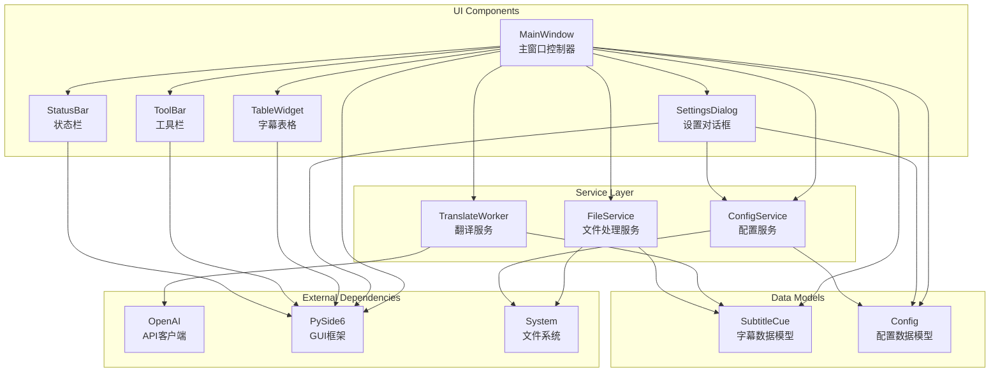

## 详细组件接口

### 数据模型组件
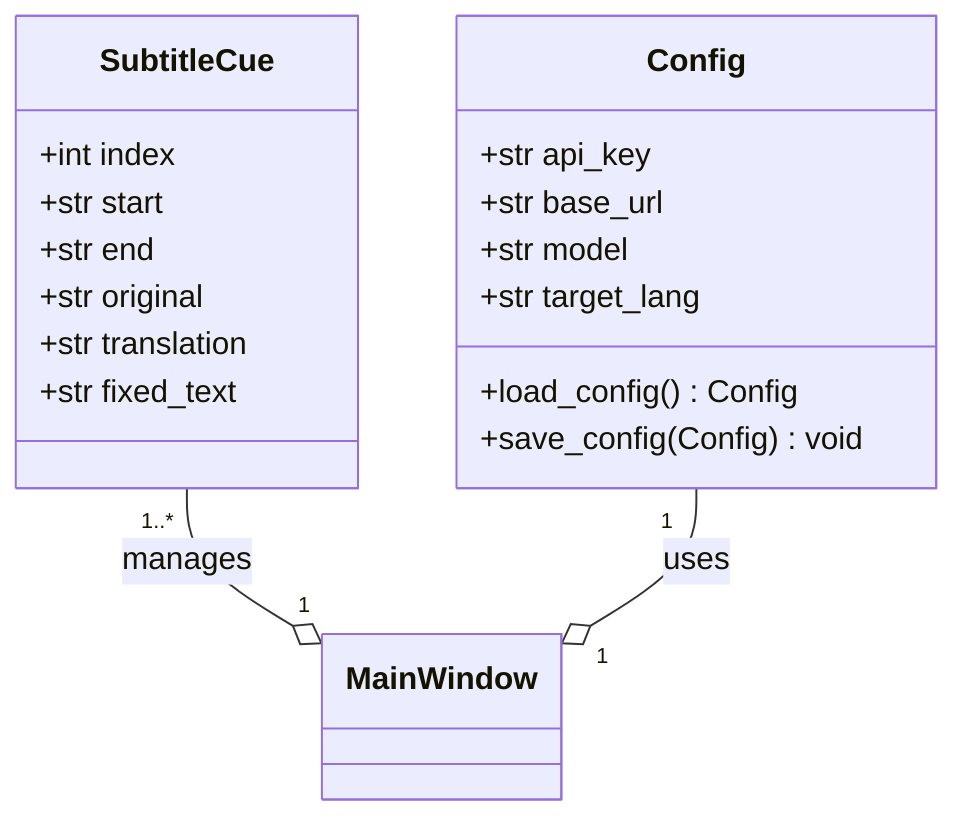

### 服务层组件
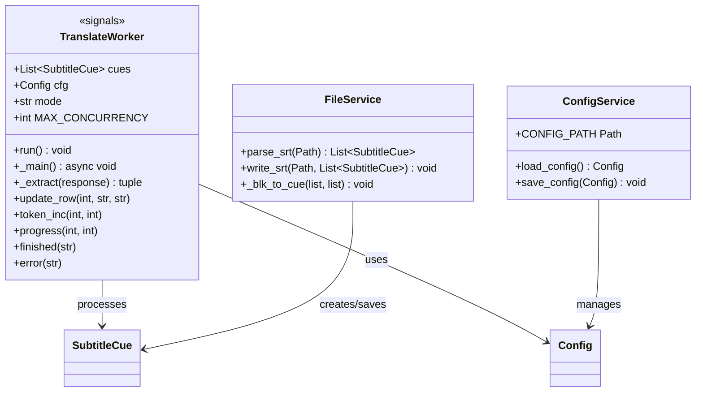

### UI组件层次
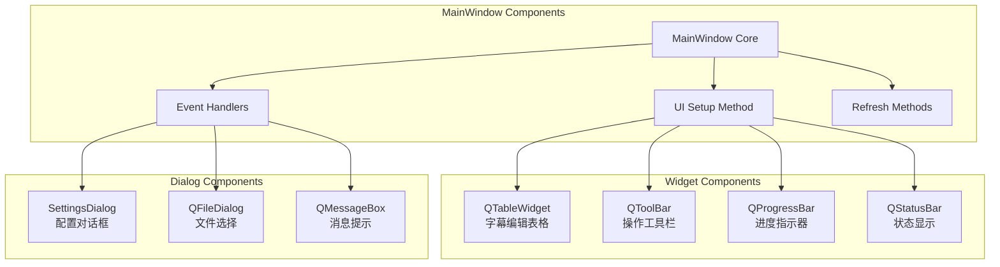

## 组件间通信机制

### 信号槽通信图
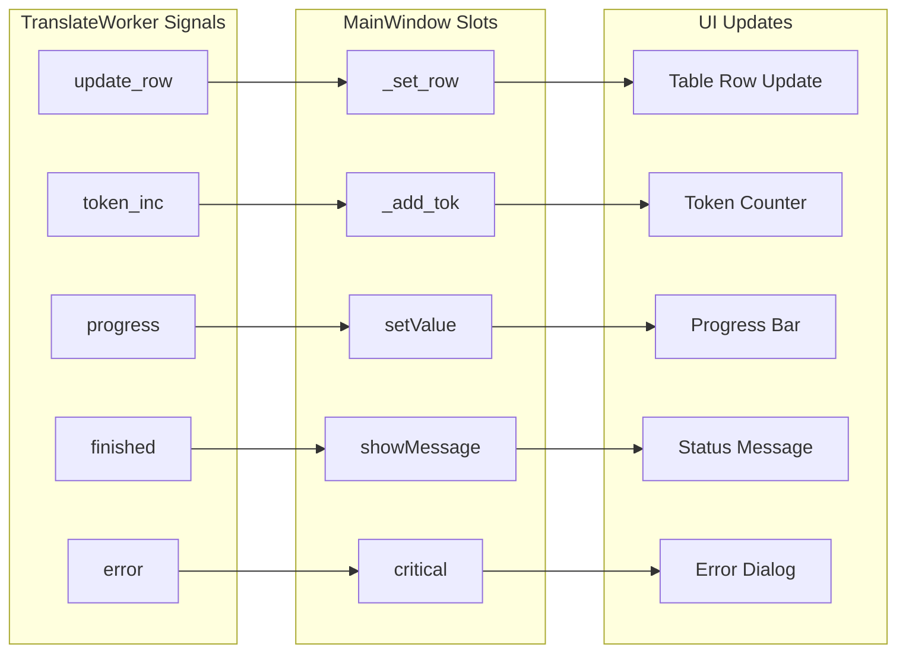

### 数据流组件交互
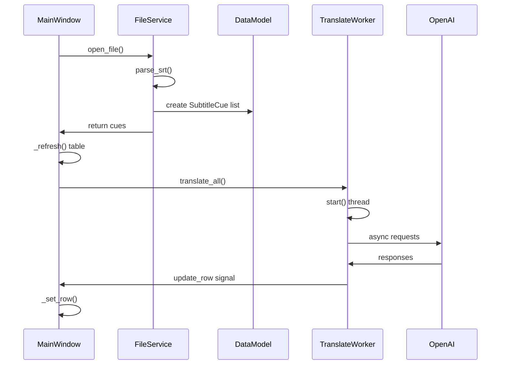

## 组件配置和初始化

### 应用程序启动序列
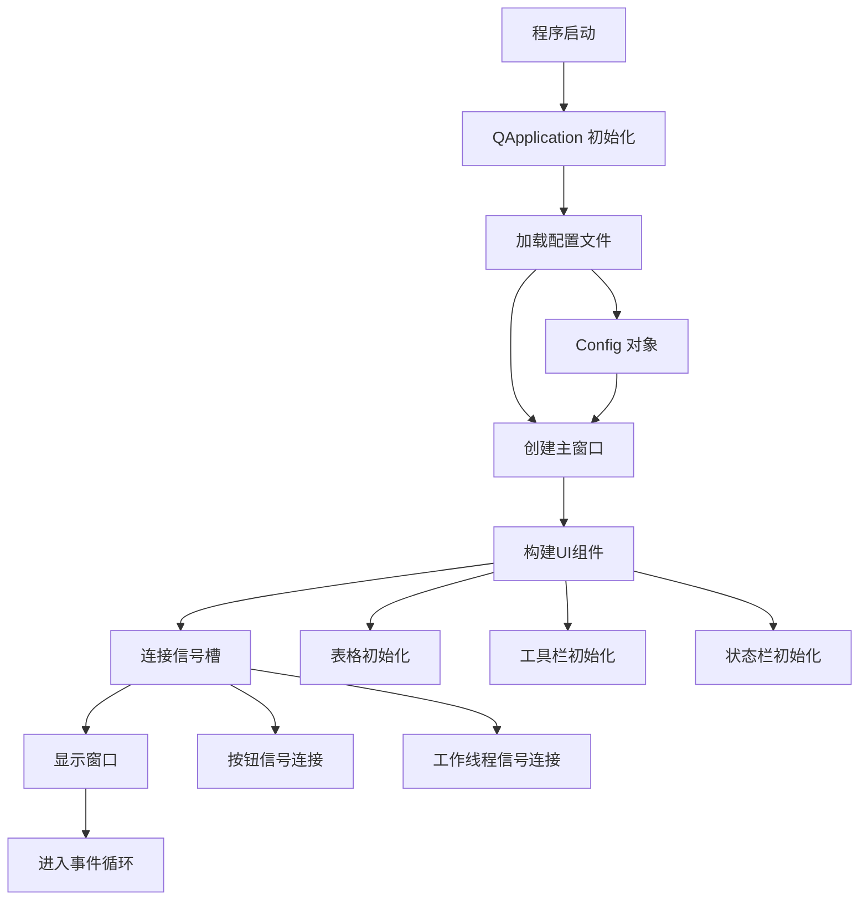

### 翻译服务初始化
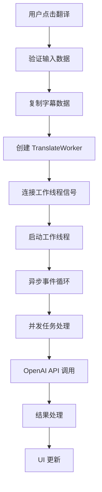

## 组件职责分离

### 单一职责原则应用
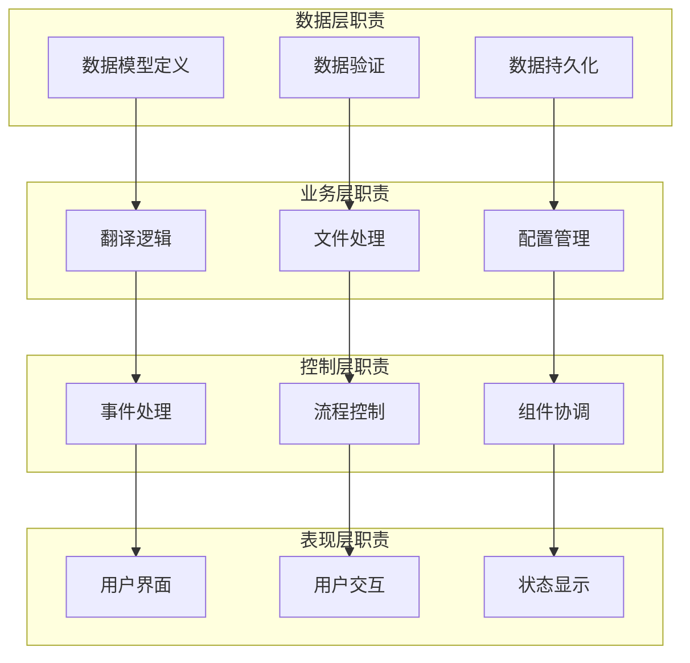

### 依赖注入模式
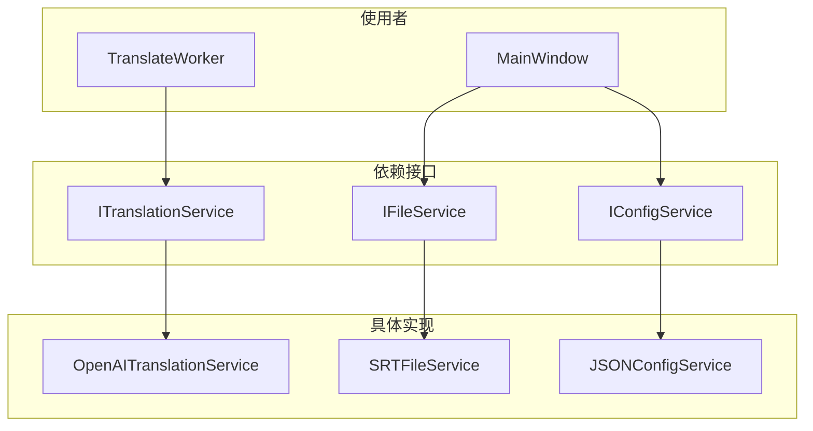

## 扩展性设计

### 插件化架构潜力
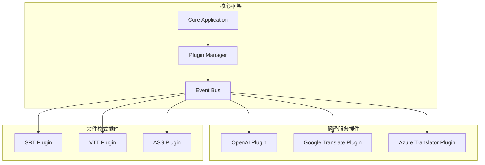

### 配置驱动的组件系统
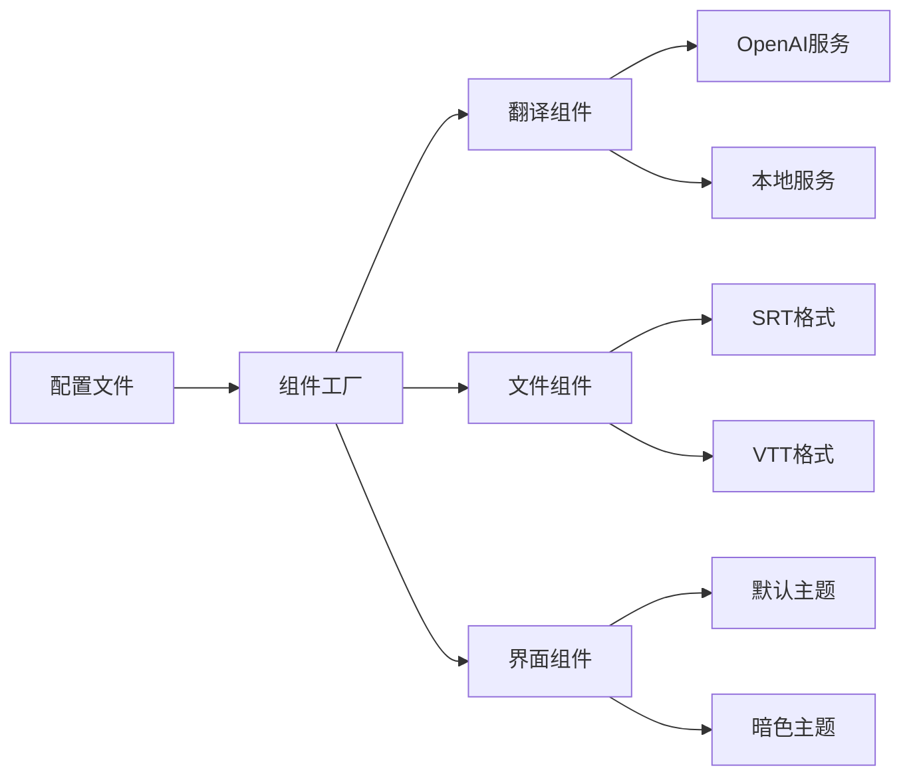

这个组件关系图展示了系统的模块化设计，清晰地定义了各组件的职责边界和交互方式，为后续的扩展和维护提供了良好的架构基础。