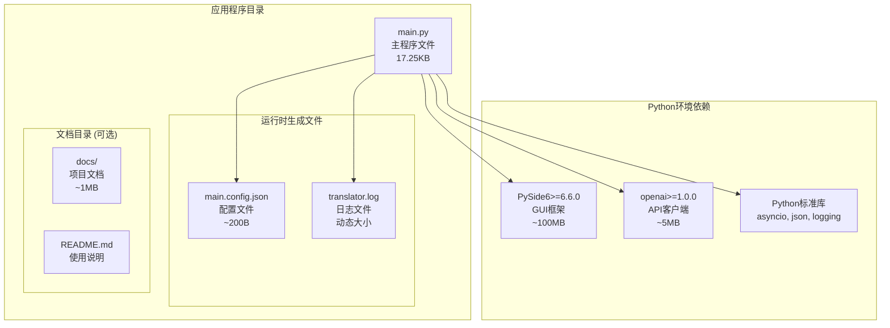
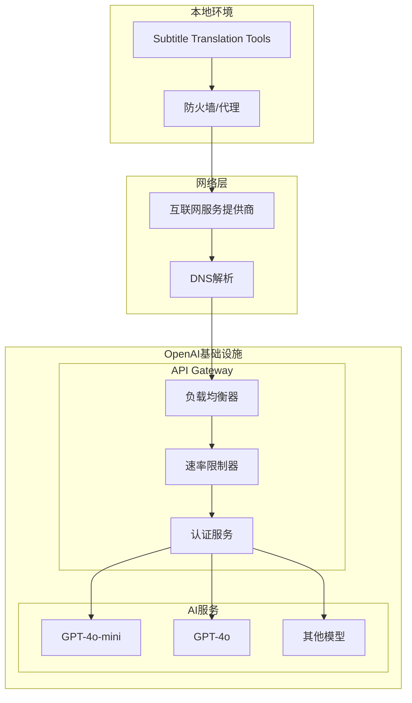
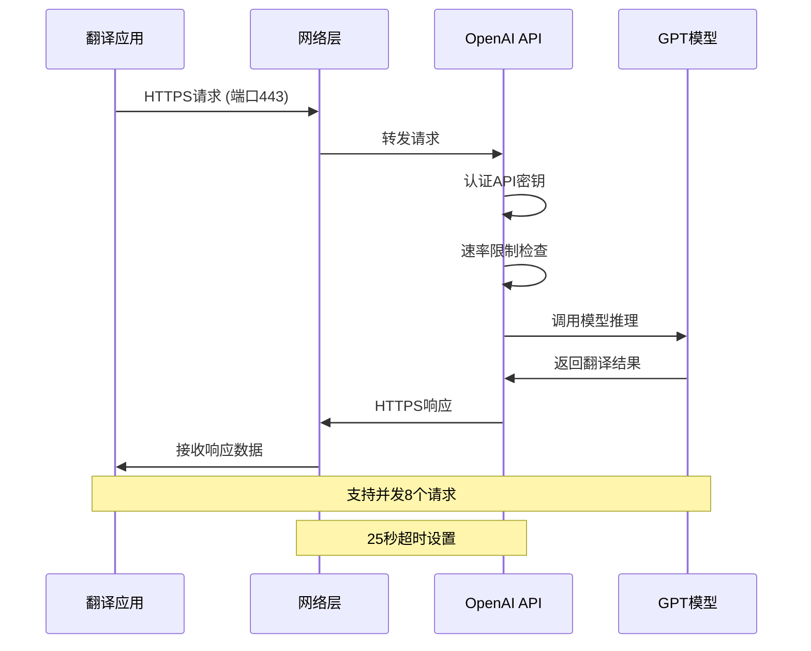
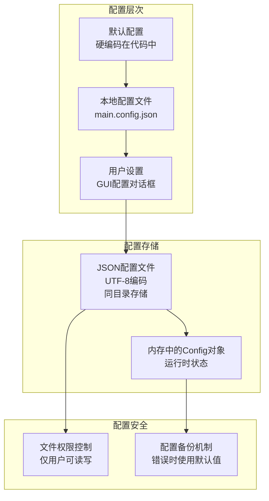
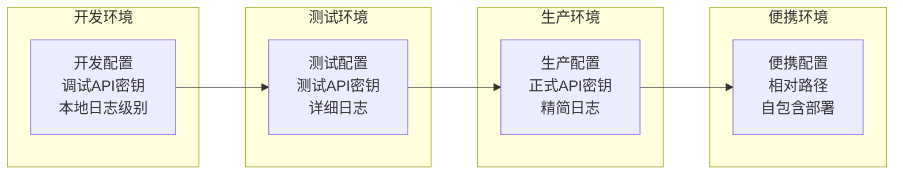
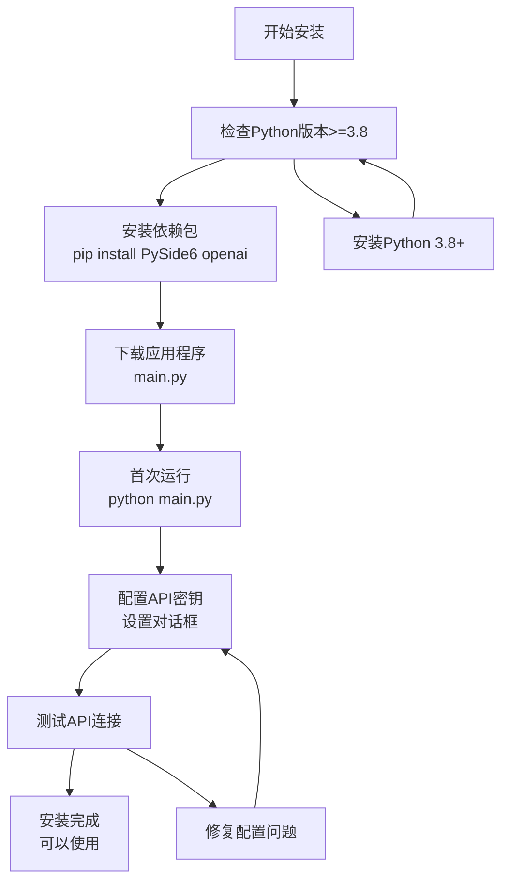
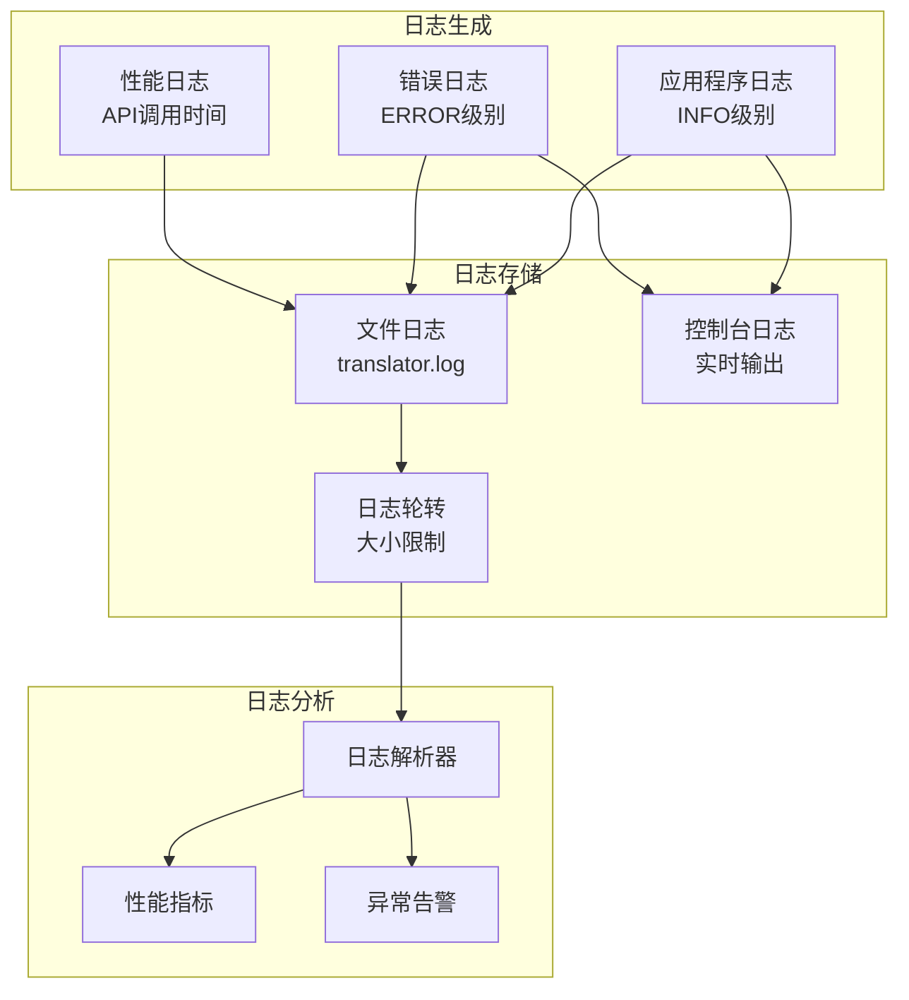
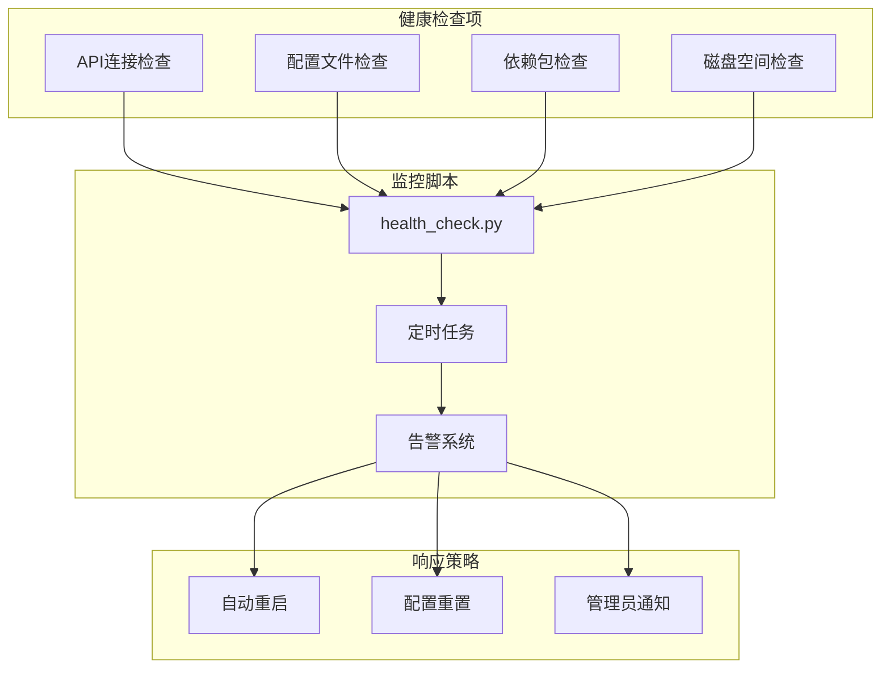
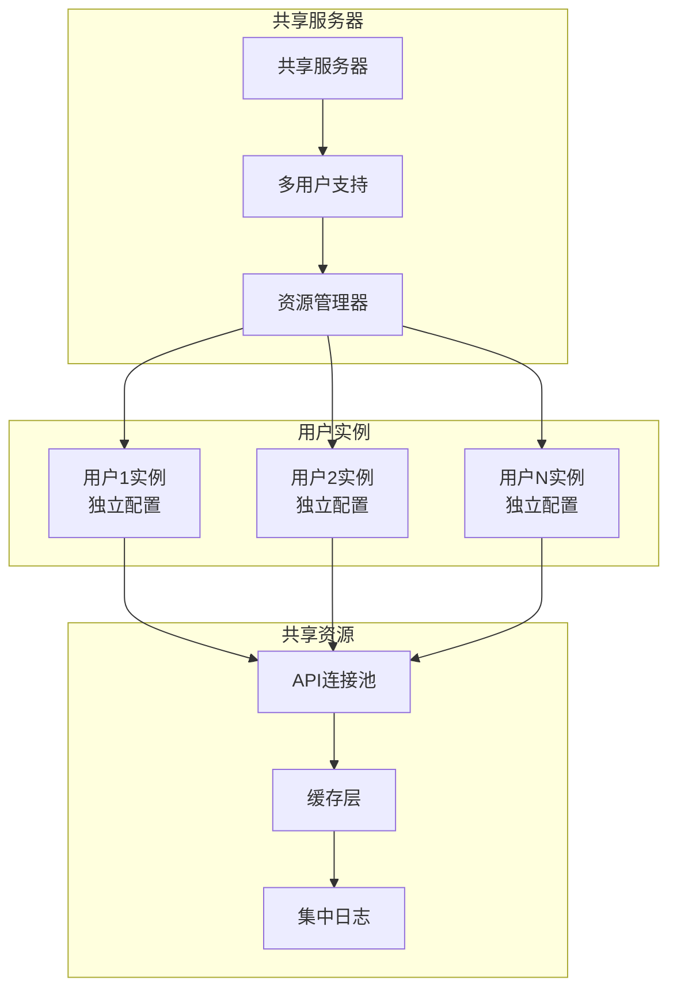
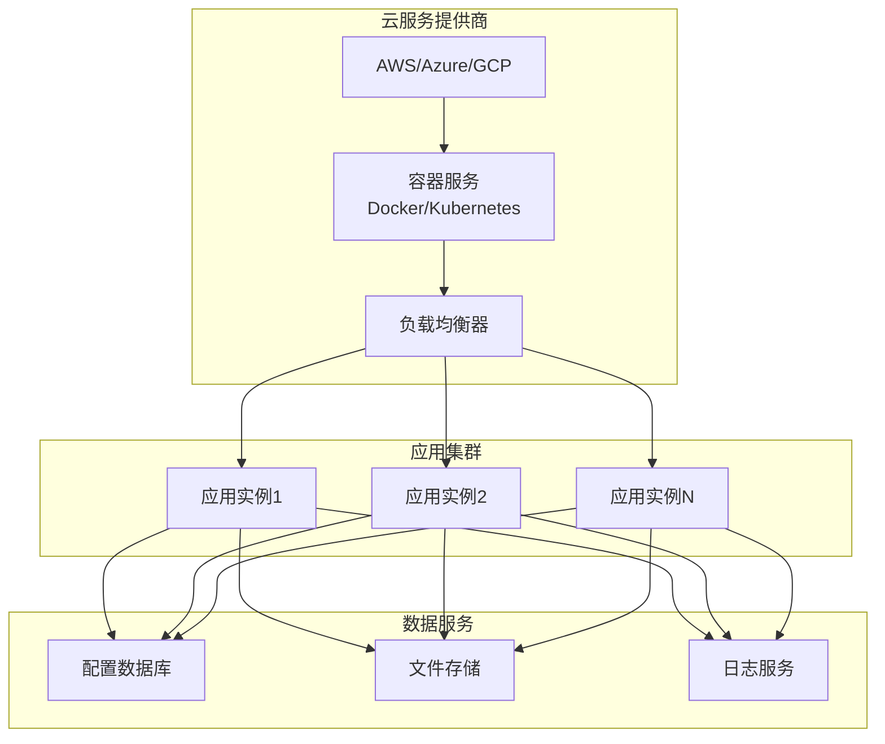

# Subtitle Translation Tools 部署架构

## 单机部署架构

```mermaid
deployment
    node "用户桌面环境" {
        node "操作系统层" {
            component "Windows 10+/macOS 10.14+/Linux"
            component "GUI子系统 (X11/Wayland/GDI)"
            component "文件系统 (NTFS/APFS/ext4)"
            component "网络栈 (TCP/IP)"
        }
        
        node "Python运行时环境" {
            component "Python 3.8+ 解释器"
            component "标准库 (asyncio, json, logging)"
            component "第三方依赖包"
        }
        
        node "应用程序层" {
            artifact "main.py" as APP
            artifact "main.config.json" as CONFIG
            artifact "translator.log" as LOG
        }
        
        node "依赖库" {
            component "PySide6 (GUI框架)"
            component "OpenAI SDK (API客户端)"
        }
    }
    
    cloud "外部服务" {
        node "OpenAI 服务" {
            interface "API Gateway"
            component "GPT-4o-mini"
            component "GPT-4o"
        }
    }
    
    APP --> CONFIG : 读写配置
    APP --> LOG : 写入日志
    APP ..> "OpenAI 服务" : HTTPS API调用
```

## 详细部署组件

### 系统依赖层
```mermaid
graph TB
    subgraph "硬件层"
        CPU[CPU: 双核2GHz+<br/>推荐: 四核心]
        MEM[内存: 4GB+<br/>推荐: 8GB+]
        DISK[存储: 100MB+<br/>推荐: SSD]
        NET[网络: 1Mbps+<br/>推荐: 5Mbps+]
    end
    
    subgraph "操作系统层"
        OS_WIN[Windows 10+]
        OS_MAC[macOS 10.14+]
        OS_LINUX[Ubuntu 18.04+]
        GUI_SYS[GUI子系统支持]
    end
    
    subgraph "运行时环境"
        PY_RT[Python 3.8+ Runtime]
        SYS_LIBS[系统标准库]
        PKG_MGR[包管理器 (pip)]
    end
    
    CPU --> OS_WIN
    CPU --> OS_MAC
    CPU --> OS_LINUX
    MEM --> GUI_SYS
    
    OS_WIN --> PY_RT
    OS_MAC --> PY_RT
    OS_LINUX --> PY_RT
    GUI_SYS --> SYS_LIBS
    
    PY_RT --> PKG_MGR
```

### 应用程序部署结构


## 网络架构

### 网络连接图


### API通信流程


## 配置管理部署

### 配置文件部署策略


### 环境适配部署


## 安装部署流程

### 标准安装流程


### 自动化部署脚本
```bash
#!/bin/bash
# 部署脚本示例

# 检查Python版本
python_version=$(python3 --version 2>&1 | grep -Po '(?<=Python )\d+\.\d+')
if (( $(echo "$python_version < 3.8" | bc -l) )); then
    echo "Error: Python 3.8+ required"
    exit 1
fi

# 安装依赖
pip install PySide6>=6.6.0 openai>=1.0.0

# 下载主程序
wget https://example.com/main.py -O main.py

# 设置执行权限
chmod +x main.py

# 创建启动脚本
cat > start_translator.sh << EOF
#!/bin/bash
cd "$(dirname "$0")"
python3 main.py
EOF

chmod +x start_translator.sh

echo "安装完成! 运行 ./start_translator.sh 启动应用"
```

## 监控和维护部署

### 日志管理部署


### 健康检查部署


## 扩展部署架构

### 多用户部署模式


### 云端部署架构


这个部署架构图提供了从单机部署到云端扩展的完整部署方案，涵盖了安装、配置、监控和维护的各个方面，为不同规模的使用场景提供了参考。