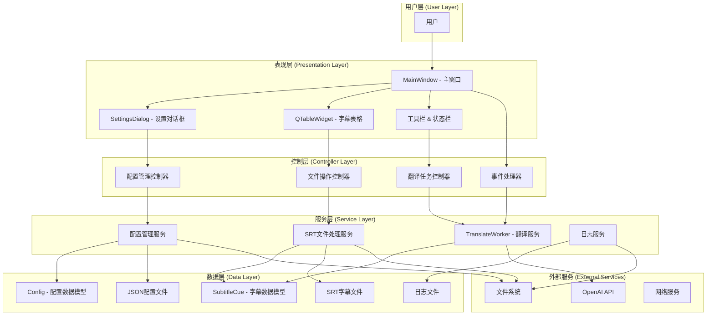
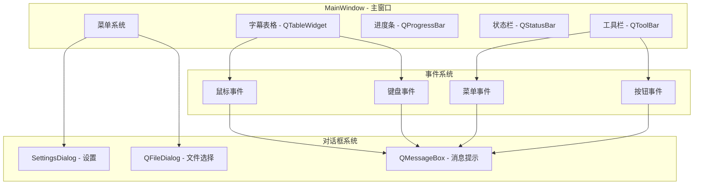
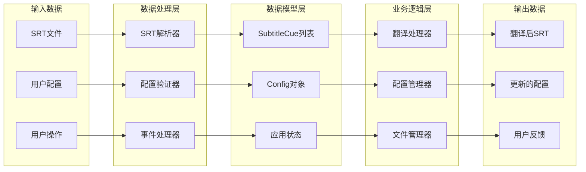
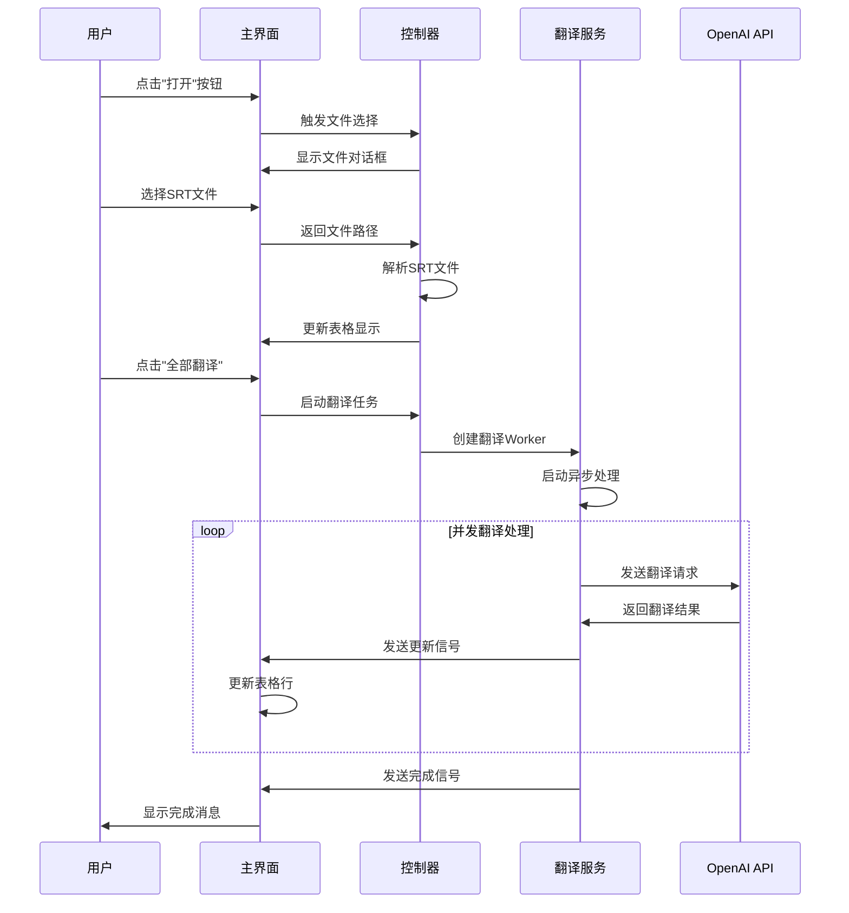
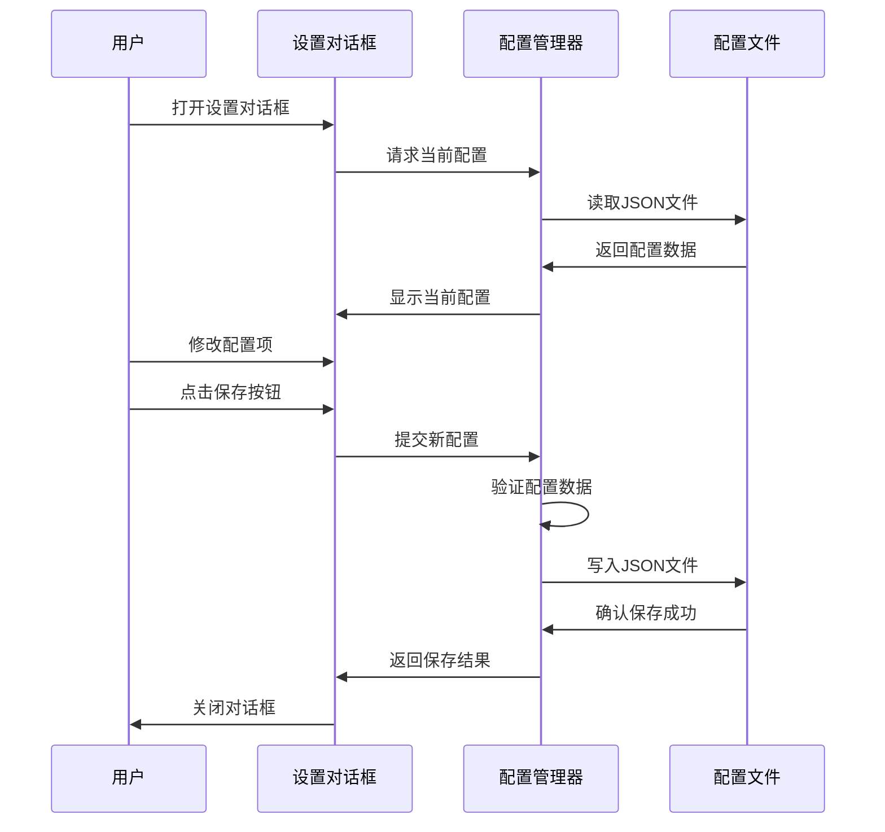
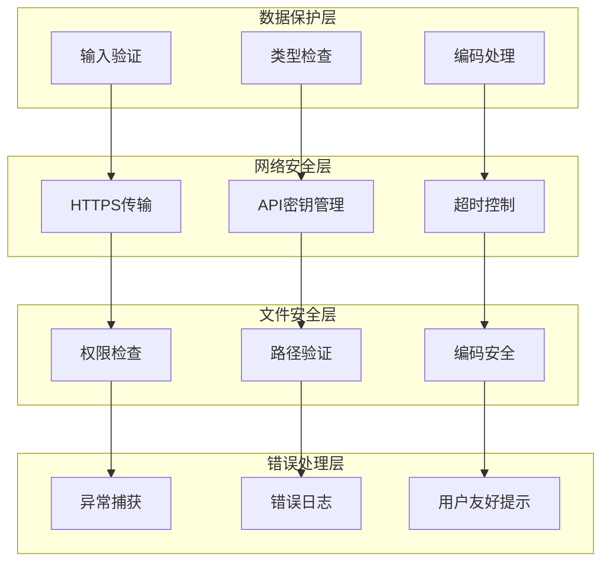
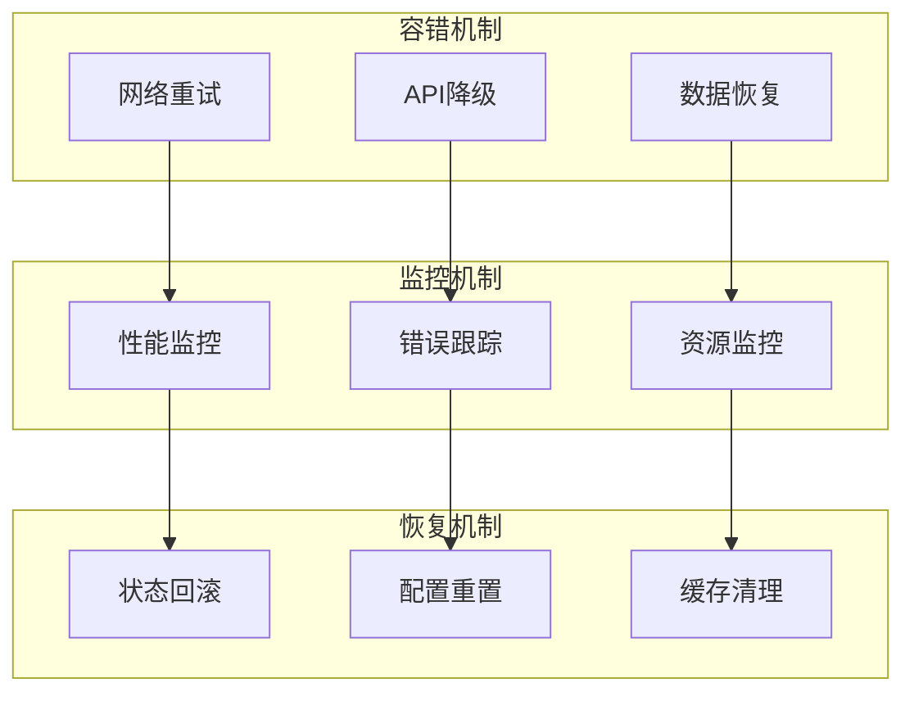

# Subtitle Translation Tools 系统架构图

## 整体系统架构



## 详细组件架构

### 用户界面层架构


### 异步处理架构
```mermaid
graph TB
    subgraph "主线程 (UI Thread)"
        UI[用户界面]
        MC[主控制器]
        SIG[信号处理器]
    end
    
    subgraph "工作线程 (Worker Thread)"
        TW[TranslateWorker]
        AE[异步事件循环]
        TM[任务管理器]
    end
    
    subgraph "异步任务池"
        T1[翻译任务1]
        T2[翻译任务2]
        T3[翻译任务N]
        SEM[信号量控制器<br/>Semaphore(8)]
    end
    
    subgraph "外部API"
        API[OpenAI API]
        NET[网络层]
    end
    
    UI --> MC
    MC --> TW
    TW --> AE
    AE --> TM
    TM --> SEM
    
    SEM --> T1
    SEM --> T2
    SEM --> T3
    
    T1 --> API
    T2 --> API
    T3 --> API
    
    API --> NET
    
    T1 --> SIG
    T2 --> SIG
    T3 --> SIG
    SIG --> UI
```

### 数据流架构


## 模块间依赖关系

### 核心模块依赖图
```mermaid
graph TB
    subgraph "配置模块"
        CM1[Config dataclass]
        CM2[load_config()]
        CM3[save_config()]
    end
    
    subgraph "数据模型模块"
        DM1[SubtitleCue dataclass]
        DM2[数据验证]
        DM3[类型转换]
    end
    
    subgraph "文件处理模块"
        FM1[parse_srt()]
        FM2[write_srt()]
        FM3[_blk_to_cue()]
    end
    
    subgraph "翻译服务模块"
        TS1[TranslateWorker]
        TS2[_main() - 异步逻辑]
        TS3[_extract() - 响应解析]
    end
    
    subgraph "UI控制模块"
        UC1[MainWindow]
        UC2[SettingsDialog]
        UC3[事件处理方法]
    end
    
    CM1 --> UC1
    CM2 --> UC1
    CM3 --> UC2
    
    DM1 --> FM1
    DM1 --> FM2
    DM1 --> TS1
    
    FM1 --> UC1
    FM2 --> UC1
    FM3 --> FM1
    
    TS1 --> UC1
    TS2 --> TS1
    TS3 --> TS2
    
    UC2 --> CM3
    UC3 --> TS1
```

### 信号槽连接架构
```mermaid
graph TB
    subgraph "TranslateWorker 信号"
        S1[update_row<br/>Signal(int,str,str)]
        S2[token_inc<br/>Signal(int,int)]
        S3[progress<br/>Signal(int,int)]
        S4[finished<br/>Signal(str)]
        S5[error<br/>Signal(str)]
    end
    
    subgraph "MainWindow 槽函数"
        SLOT1[_set_row()<br/>更新表格行]
        SLOT2[_add_tok()<br/>更新Token计数]
        SLOT3[setValue()<br/>更新进度条]
        SLOT4[showMessage()<br/>显示完成消息]
        SLOT5[critical()<br/>显示错误对话框]
    end
    
    subgraph "UI 组件更新"
        UI1[QTableWidget<br/>表格更新]
        UI2[QLabel<br/>Token显示]
        UI3[QProgressBar<br/>进度显示]
        UI4[QStatusBar<br/>状态显示]
        UI5[QMessageBox<br/>错误提示]
    end
    
    S1 --> SLOT1 --> UI1
    S2 --> SLOT2 --> UI2
    S3 --> SLOT3 --> UI3
    S4 --> SLOT4 --> UI4
    S5 --> SLOT5 --> UI5
```

## 系统交互流程

### 典型用户操作流程


### 配置管理流程


## 安全架构考虑

### 数据安全架构


### 系统健壮性架构


这个系统架构图展示了 Subtitle Translation Tools 的完整技术架构，包括各层级的组件关系、数据流向、以及关键的安全和健壮性考虑。架构设计强调了模块化、可扩展性和用户体验的平衡。