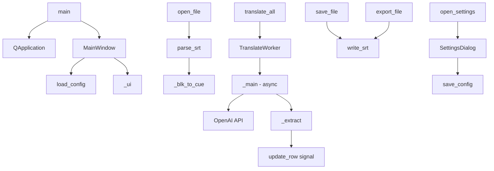

# 文件分析报告：main.py

## 文件概述

main.py 是一个基于 PySide6 的 AI 字幕翻译器应用程序，专门用于翻译 SRT 字幕文件。该应用程序整合了 OpenAI API 进行智能翻译，提供图形化用户界面，支持并发处理和配置持久化。

主要功能包括：
- SRT 字幕文件的解析和写入
- 基于 OpenAI API 的智能翻译
- 8 通道并发翻译处理
- 翻译结果的实时润色和修复
- 配置信息的持久化存储
- 完整的图形化用户界面

## 代码结构分析

### 导入依赖

```python
import sys, asyncio, logging, datetime, json
from dataclasses import dataclass
from pathlib import Path
from typing import List, Tuple

from openai import AsyncOpenAI
from PySide6.QtCore import Qt, QThread, Signal
from PySide6.QtWidgets import (
    QApplication, QMainWindow, QWidget, QFileDialog, QTableWidget,
    QTableWidgetItem, QVBoxLayout, QHBoxLayout, QLabel, QLineEdit,
    QPushButton, QProgressBar, QToolBar, QStatusBar, QMessageBox,
    QDialog, QComboBox, QHeaderView
)
from PySide6.QtGui import QAction
```

**依赖分析：**
- **核心依赖**: `sys`, `asyncio`, `logging`, `json` - Python 标准库
- **数据处理**: `dataclasses`, `pathlib`, `typing` - 数据结构和类型注解
- **AI 集成**: `openai.AsyncOpenAI` - OpenAI API 异步客户端
- **GUI 框架**: `PySide6.*` - 现代 Qt6 Python 绑定

### 全局变量和常量

```python
CONFIG_PATH = Path(__file__).with_suffix(".config.json")
```

**配置系统：**
- `CONFIG_PATH`: 配置文件路径，动态基于当前脚本文件名生成

### 配置和设置

```python
logging.basicConfig(
    level=logging.INFO,
    format="[%(asctime)s] %(levelname)s - %(message)s",
    handlers=[logging.StreamHandler(sys.stdout),
              logging.FileHandler("translator.log", encoding="utf-8")]
)
log = logging.getLogger("translator")
```

**日志配置：**
- 双重输出：控制台 + 文件（translator.log）
- INFO 级别日志记录
- UTF-8 编码确保中文支持

## 函数详细分析

### 函数概览表

| 函数名 | 参数 | 返回值 | 主要功能 |
|--------|------|--------|----------|
| `load_config()` | 无 | `Config` | 从JSON文件加载配置信息 |
| `save_config(cfg)` | `Config` | `None` | 保存配置信息到JSON文件 |
| `parse_srt(path)` | `Path` | `List[SubtitleCue]` | 解析SRT字幕文件 |
| `_blk_to_cue(blk, cues)` | `list, list` | `None` | 将文本块转换为字幕条目 |
| `write_srt(path, cues)` | `Path, List[SubtitleCue]` | `None` | 写入SRT字幕文件 |
| `main()` | 无 | `None` | 应用程序入口点 |

### 函数详细说明

#### `load_config() -> Config`
**功能**: 从配置文件加载应用设置
- 检查配置文件是否存在
- 解析JSON格式配置
- 提供默认值处理
- 异常安全机制

#### `save_config(cfg: Config)`
**功能**: 持久化配置信息
- 序列化配置对象到JSON
- UTF-8编码确保中文支持
- 错误处理和日志记录

#### `parse_srt(path: Path) -> List[SubtitleCue]`
**功能**: SRT文件解析器
- 逐行读取文件内容
- 处理字幕时间轴格式
- 构建字幕条目对象列表
- 支持UTF-8编码和错误忽略

#### `write_srt(path: Path, cues: List[SubtitleCue])`
**功能**: SRT文件生成器
- 按标准SRT格式输出
- 优先使用修复后文本
- 备选翻译文本或原文
- UTF-8编码输出

## 类详细分析

### 类概览表

| 类名 | 基类 | 主要职责 | 关键属性/方法 |
|------|------|----------|---------------|
| `Config` | `dataclass` | 配置数据结构 | api_key, base_url, model, target_lang |
| `SubtitleCue` | `dataclass` | 字幕条目数据 | index, start, end, original, translation, fixed_text |
| `TranslateWorker` | `QThread` | 异步翻译处理线程 | run(), _main(), _extract() |
| `MainWindow` | `QMainWindow` | 主界面窗口 | _ui(), _refresh(), open_file(), translate_all() |
| `SettingsDialog` | `QDialog` | 设置对话框 | accept(), reject() |

### 类详细说明

#### `Config` (dataclass)
**数据结构**: 应用配置信息
```python
@dataclass
class Config:
    api_key: str = ""
    base_url: str = ""
    model: str = "gpt-4o-mini"
    target_lang: str = "中文"
```

#### `SubtitleCue` (dataclass)
**数据结构**: 字幕条目
```python
@dataclass
class SubtitleCue:
    index: int
    start: str
    end: str
    original: str
    translation: str = ""
    fixed_text: str = ""
```

#### `TranslateWorker` (QThread)
**异步翻译处理器**
- **并发控制**: 8通道并发限制 (`MAX_CONCURRENCY=8`)
- **信号机制**: 实时更新GUI状态
- **翻译模式**: 支持翻译(translate)和修复(fix)两种模式
- **错误处理**: 异常捕获和错误报告

**核心方法**:
- `run()`: 线程入口点，启动异步事件循环
- `_main()`: 主要异步逻辑，管理并发翻译任务
- `_extract()`: 统一解析OpenAI API响应格式

#### `MainWindow` (QMainWindow)
**主界面控制器**
- **UI组件**: 工具栏、表格、进度条、状态栏
- **文件操作**: 打开、保存、导出SRT文件
- **翻译控制**: 启动翻译和修复任务
- **历史管理**: 撤销操作支持

**关键功能**:
- `_ui()`: 构建用户界面
- `_refresh()`: 刷新表格数据显示
- `translate_all()` / `fix_all()`: 启动翻译任务
- `open_settings()`: 打开设置对话框

#### `SettingsDialog` (QDialog)
**配置界面**
- 预定义模型选择
- 多语言支持
- API配置输入
- 配置验证和保存

## 函数调用流程图


## 变量作用域分析

### 全局作用域
- `CONFIG_PATH`: 配置文件路径常量
- `log`: 全局日志器实例

### 类作用域
- `Config`: 配置数据字段
- `SubtitleCue`: 字幕数据字段
- `TranslateWorker`: 
  - `MAX_CONCURRENCY`: 并发限制常量
  - 实例变量: `cues`, `cfg`, `mode`
- `MainWindow`: 
  - 实例变量: `cfg`, `cues`, `history`, `current_file`
  - UI组件: `table`, `progress`, `status`, `token_lbl`

### 函数局部作用域
- `parse_srt()`: `cues`, `blk` - 临时数据容器
- `TranslateWorker._main()`: `client`, `sem`, `tasks` - 异步处理相关

## 函数依赖关系

### 配置模块依赖
```
load_config() ← MainWindow.__init__()
save_config() ← SettingsDialog.accept()
```

### 文件处理依赖
```
parse_srt() ← MainWindow.open_file()
  └── _blk_to_cue() ← parse_srt()
write_srt() ← MainWindow.save_file()
write_srt() ← MainWindow.export_file()
```

### 翻译处理依赖
```
TranslateWorker ← MainWindow.translate_all()
TranslateWorker ← MainWindow.fix_all()
  └── _main() ← TranslateWorker.run()
      └── _extract() ← _main()
```

### UI依赖关系
```
MainWindow._ui() ← MainWindow.__init__()
MainWindow._refresh() ← MainWindow.open_file()
SettingsDialog ← MainWindow.open_settings()
```

## 数据流分析

### 配置数据流
1. **启动时**: `load_config()` → `Config` 对象 → `MainWindow.cfg`
2. **设置时**: 用户输入 → `SettingsDialog` → `save_config()` → JSON文件

### 字幕数据流
1. **导入**: SRT文件 → `parse_srt()` → `List[SubtitleCue]` → 表格显示
2. **翻译**: 原文 → OpenAI API → 译文 → `SubtitleCue.translation`
3. **修复**: 译文 → OpenAI API → 修复文本 → `SubtitleCue.fixed_text`
4. **导出**: `SubtitleCue` 列表 → `write_srt()` → SRT文件

### 信号数据流 (Qt Signals)
```
TranslateWorker.update_row → MainWindow._set_row
TranslateWorker.token_inc → MainWindow._add_tok
TranslateWorker.progress → QProgressBar.setValue
TranslateWorker.error → QMessageBox.critical
TranslateWorker.finished → 状态消息更新
```

## 错误处理

### 配置错误处理
- JSON解析异常：记录警告，使用默认配置
- 文件写入失败：记录错误，保留原配置

### 网络错误处理  
- API调用超时：25秒超时限制
- 响应格式错误：统一响应解析器 `_extract()`
- HTML响应检测：识别配置错误的base_url

### 文件操作错误处理
- SRT解析：使用 `errors="ignore"` 忽略编码错误
- 文件不存在：对话框取消操作时的空值检查

### GUI错误处理
- 空数据检查：操作前验证cues列表
- 配置缺失：API Key为空时的警告提示

## 性能分析

### 并发设计
- **异步处理**: 使用 `asyncio` 和 `AsyncOpenAI`
- **并发限制**: `Semaphore(8)` 控制同时请求数
- **结果有序**: `asyncio.as_completed()` 保证结果按完成顺序处理

### 内存管理
- **数据复制**: 翻译前复制cues列表避免UI阻塞
- **历史记录**: 维护操作历史支持撤销功能
- **实时更新**: 使用Qt信号机制实时更新UI

### I/O优化
- **流式处理**: SRT解析采用逐行读取
- **缓冲写入**: 批量写入字幕文件
- **编码处理**: UTF-8编码确保多语言支持

## 算法复杂度

### 时间复杂度
- **SRT解析**: O(n), n为文件行数
- **翻译处理**: O(k), k为字幕条目数，受并发限制影响
- **UI刷新**: O(n), n为显示的字幕条目数

### 空间复杂度
- **字幕存储**: O(n), n为字幕条目数，每个条目包含原文、译文、修复文本
- **历史记录**: O(m*n), m为历史版本数，n为字幕条目数

## 扩展性评估

### 可扩展点
1. **翻译提供商**: 当前仅支持OpenAI，可扩展支持其他AI服务
2. **文件格式**: 当前仅支持SRT，可扩展VTT、ASS等格式
3. **翻译模式**: 可添加更多专业翻译模式和提示词
4. **UI主题**: 可扩展更多界面主题和样式

### 架构限制
- **单体应用**: 所有功能集中在一个文件中
- **GUI耦合**: 业务逻辑与界面逻辑混合
- **配置简化**: 配置选项相对有限

## 代码质量评估

### 优点
- **类型注解**: 较好的类型提示覆盖
- **异步设计**: 现代异步编程模式
- **错误处理**: 合理的异常捕获机制
- **配置管理**: 持久化配置系统

### 改进空间
- **代码组织**: 可拆分为多个模块文件
- **测试覆盖**: 缺少单元测试
- **文档注释**: 可增加更多函数文档
- **常量提取**: 一些硬编码值可提取为常量

## 文档完整性

### 现有文档
- **文件头注释**: 版本信息和主要特性说明
- **函数注释**: 部分关键函数有简要说明

### 文档建议
- 添加API文档说明
- 增加使用示例
- 补充安装和配置指南
- 提供故障排除指南

## 注释

该应用程序展现了现代Python GUI开发的良好实践，特别是在异步处理和Qt集成方面。代码结构清晰，功能完整，是一个实用的AI翻译工具实现。主要的改进方向是模块化重构和测试覆盖提升。